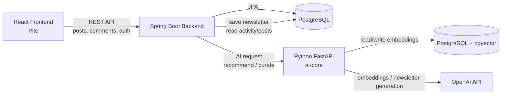
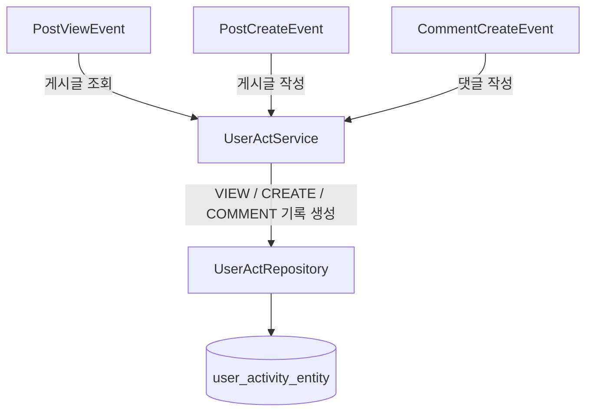
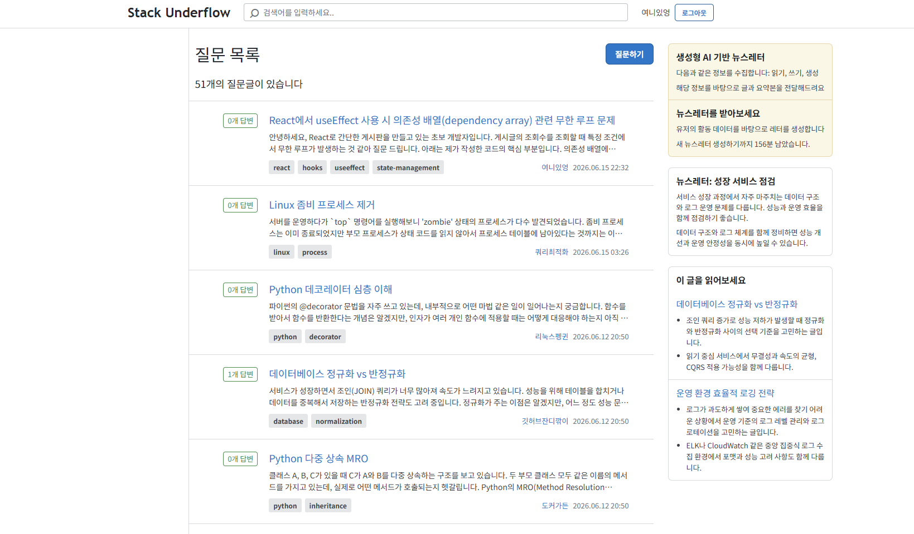
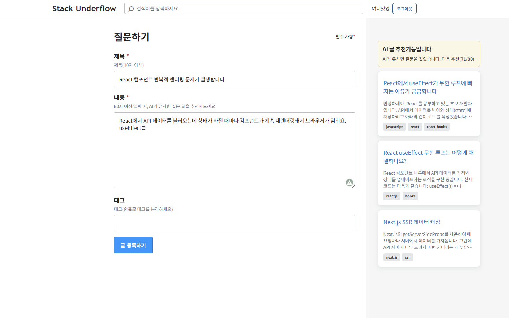
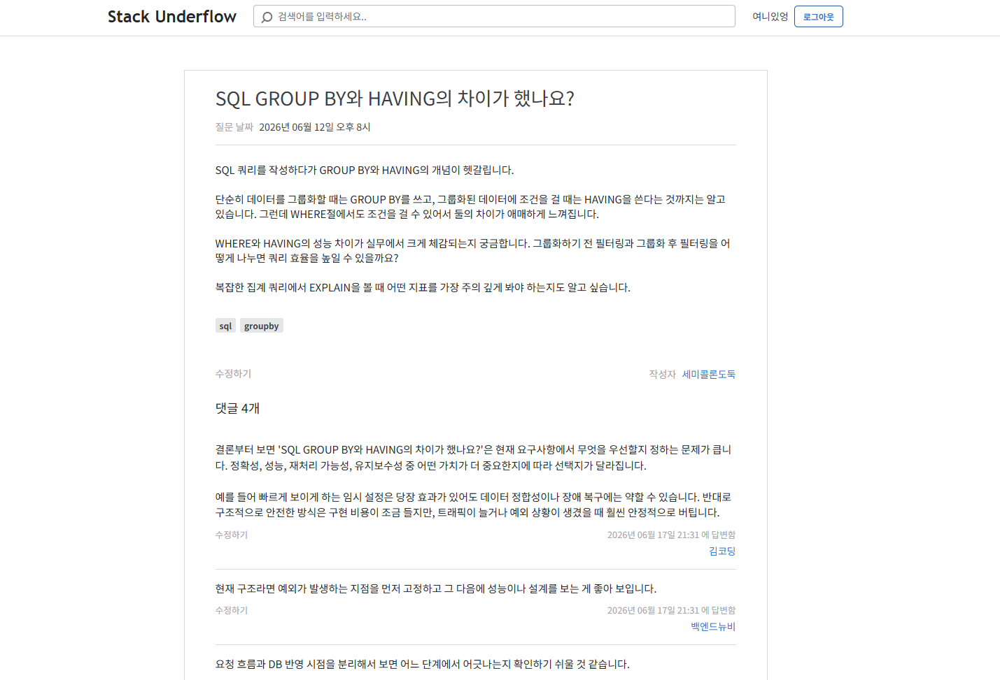

AI 응용 기술을 활용한 게시판 구현 개인 과제 제출 저장소입니다
<br>

### 1. 프로젝트 개요

Stack Overflow를 모방한 웹 프로젝트.  
선정 이유: 게시판 형식에 충실, 글 => 댓글 종속관계 명확, 지식기반 형태(AI 데이터 활용에 적합)  
  
**주요 기능**
**Auth**: 로그인, 회원가입 (Refresh 및 Access 토큰 발급)  
**CRUD**: 글/댓글 작성, 수정, pageable(10개씩 호출)기능  
**AI**: RAG(유사 게시글 자동 추천), AGENT(개인 맞춤형 큐레이터)  
<br>

### 2. 전체 아키텍처 구조

아키텍처는 크게 다음과 같이 구성됩니다:  
Back-end(Spring Boot) 
Front-end(React)   
AI-Server(FastAPI)  


**Front <=> Back 소통**: 로그인이 필요한 서비스의 경우 `SecurityContextHolder`로 auth 획득  
**Back <=> AI 소통**: Back에서 DB에 저장, 불러오기를 책임짐(pg_vector는 예외)  
<br>  

### 3 AI 기능

**3-1. RAG 기능 구조**  
|파일 명|기능|구조(함수명)|
|:---|:---|:---|
|`ingestion_pipeline`|임베딩 백터 생성|`load_documents`: Spring에서 게시글 가져옴, List 객체로 만듦 <br>`create_vector_store`: OpenAI 임베딩 모델 준비, documents를 PGVector로 변환|
|`retrieval_pipeline`|검색 수행|`recommend_posts`: query를 임베딩화 => 기존 글의 벡터와 유사도 검색, 가장 가까운 3개 반환|

*chunking 전략?*  
"글을 추천하는 모델"인 만큼, 임의의 단위로 chuncking하여 백터를 생성하기 보단,  
게시글 하나(제목 + 본문 + 태그 + 댓글)이 합쳐져 "무슨 글"인지 나타낼 수 있다고 판단.  
=> 게시글 하나: 백터 1개.. 로 설계  
<br>

**3-2. Agent 기능 구조**  
|함수 명|기능|구조 해설|
|:---|:---|:---|
|`load_user_activities`|유저 활동 기록 수집|Spring에서 특정 유저의 **활동기록** DB를 가져온다 => 이를 List 형태의 객체로 만들어 반환|
|`calculate_user_interest`|interest 백터값 산출|활동기록(게시글에서의 VIEW, COMMENT, CREATE)의 각각 가중치 부여 => 해당 게시글의 임베딩 백터를 통해 **가중치 평균 산출**|
|`similarity_search`|게시글 검색|interest 백터값과 유사한 백터(postId)를 2개를 찾아내어 반환|
|`generate_newsletter`|뉴스레터 생성|OpenAI에 instruction과 input을 제공하여, JSON 형식 뉴스레터 생성을 지시|

<br>

**실제 호출되는 라우터 함수**
```
@router.post("/curate")
def curated_newsletter(request: CurateRequest):
    
    activities = load_user_activities(request.user_id)
    interest_vec = calculate_user_interest(activities)
    curated_posts = similarity_search(interest_vec)
    newsletter = generate_newsletter(curated_posts)

    return { newsletter JSON 구조체 반환 }
```
<br>

*활동기록 수집하기: 내부 이벤트 처리*  
특정 유저의 history를 파악하려면, 내부 이벤트(글 조회, 댓글 작성 등)를 파악하여 이를 기록할 필요성이 있음.  
이를 아키텍처로 표현하면 다음과 같다:  

<br>

## 4. 데모 스크린샷

**진입페이지 화면: 로그인 한 사용자에게 뉴스레터가 제공됨(좌측)**

<br>

**글 작성 화면: 글 내용을 감지한 다음, 사용자에게 기존 유사 글 제공**

<br>

**게시글 상세 화면: 글 내용과 댓글이 표시됨**

<br>

## 5. 회고

**우선순위 설정을 통한 빠른 구현**  
2주 간의 시간동안 프론트-백, AI 기능을 결합해야 하는 만큼, 톱 다운 방식으로 빠르게 학습을 진행.  
지엽적이라 판단한 부분은 input과 output 규칙만 파악하고 넘어갔으나, 전체를 잘 알지 못한다는 인상을 계속 받았습니다.  

지엽적이라 판단한 부분: Spring내 계층 간, Spring-FastAPI간 객체 전달 규약. 임베딩 규약과 행렬 연산 메서드.  
전체 흐름이라 판단한 부분: 3개의 서버 간의 전체 흐름, 객체가 전달되는 과정, 임베딩 백터 생성과  
<br>

**모듈화 & 관심사 분리**  
서비스 기능이 추가되면서, 아키텍처를 구조화할 필요성을 느꼈음.  
Spring의 경우, 처음부터 계층화된 설계를 한 만큼 확장에 용이하였으나,  
React은 페이지 단위로 나누고, 기능(컴포넌트)은 안에 내장되어 있어 파일이 비대해지는 문제가 발생.  
빠른 구현이 우선시 된 만큼, 비대한 정도를 감당하는 방향으로 결정하였으나, 아쉬움이 남음.  
